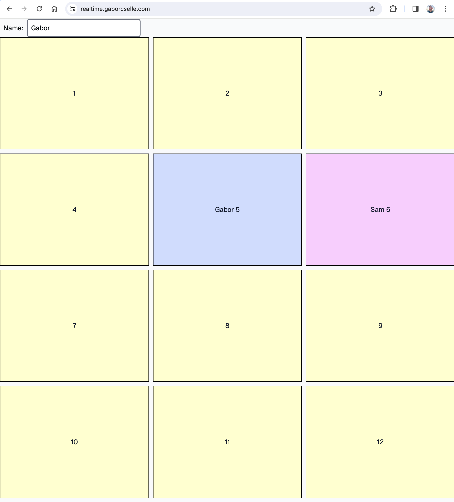

Toy experiment with Realtime Supabase. Click on a rectangle to claim it. Everyone else playing the game at the same time will see your move in real time.s

Play at https://realtime.gaborcselle.com/

Screenshot:


## How to run
1. Clone the repo
2. In the root directory, create a `.env` file with the following content:
```
NEXT_PUBLIC_SUPABASE_URL=https://<your-supabase-url>.supabase.co
NEXT_PUBLIC_SUPABASE_ANON_KEY=<your anon key>
```
3. In Supabase, create a table called `game_fields` with the following columns:
```
id: integer, primary key, auto increment
created_at: timestamp with time zone
owner: text
```
Populate it with id 1-12 and NULL as owner
4. `npm install`
5. `npm run dev`
6. Open `http://localhost:3000` in your browser

All the game logic is in `components/GameField.tsx`.